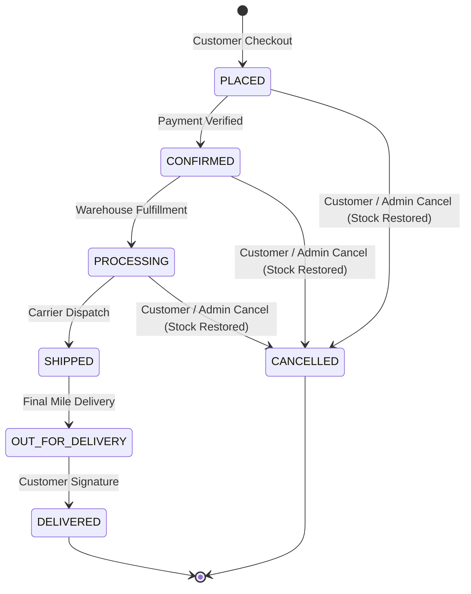

# 🛒 CartToDoor — From Cart to Your Doorstep
### Production-Grade Enterprise Order Management System (OMS) & E-Commerce Marketplace

[](https://openjdk.org/)
[](https://spring.io/projects/spring-boot)
[](https://www.mysql.com/)
[](https://react.dev/)
[](https://tailwindcss.com/)
[](https://www.docker.com/)
[](LICENSE)

**CartToDoor** is a full-stack, production-ready Order Management System (OMS) built with high concurrency, strict transactional guarantees, and zero hardcoded frontend business data. Inspired by modern hyper-scale e-commerce platforms like Amazon and Flipkart, CartToDoor handles end-to-end customer purchasing flows, real-time inventory tracking, and warehouse logistics fulfillment.

---

## 📑 Table of Contents
- [System Architecture](#-system-architecture)
- [Key Features](#-key-features)
- [Tech Stack](#-tech-stack)
- [Order Lifecycle State Machine](#-order-lifecycle-state-machine)
- [Database Schema (MySQL 8.0)](#-database-schema-mysql-80)
- [REST API Reference & Documentation](#-rest-api-reference--documentation)
- [Environment Variables & Production Configuration](#-environment-variables--production-configuration)
- [Getting Started](#-getting-started)
  - [Prerequisites](#prerequisites)
  - [Quick Start (Local Development)](#1-quick-start-local-development)
  - [Production Build & Run](#2-production-build--run)
  - [Docker Compose Deployment](#3-docker-compose-deployment)
- [Automated Testing & Verification](#-automated-testing--verification)
- [Security Architecture](#-security-architecture)
- [License](#-license)

---

## 🏗 System Architecture

```text
               +-------------------------------------------------------+
               |                  CartToDoor Frontend                  |
               |      React 18 + Vite + Tailwind CSS + Lucide Icons     |
               +-------------------------------------------------------+
                                          |
                              REST APIs / JSON (Axios)
                                          v
               +-------------------------------------------------------+
               |              Spring Boot 3.3.4 (Java 21)              |
               |-------------------------------------------------------|
               |  - Spring Security 6 (Stateless JWT Filter Chain)     |
               |  - Optimistic Locking (@Version on Products)          |
               |  - Transaction Management (@Transactional Checkout)   |
               |  - Finite State Machine (Order & Shipment Lifecycle)  |
               |  - Central Operations & KPI Aggregation Engine         |
               +-------------------------------------------------------+
                                          |
                                   Spring Data JPA
                                          v
               +-------------------------------------------------------+
               |                   MySQL 8.0 (oms_db)                  |
               |-------------------------------------------------------|
               |  users | products | categories | carts | cart_items   |
               |  orders | order_items | payments | shipments | address|
               +-------------------------------------------------------+
```

---

## ✨ Key Features

### 🛒 Customer Storefront
- **Live Catalog & Filtering**: Search products by title/keywords, filter by categories with interactive pills, sort by price and newest arrivals with pagination.
- **Real-Time Stock Alerts**: Visual badges showing remaining inventory (e.g. *"Only 3 left"*, *"Out of Stock"*).
- **Persistent Server-Side Cart**: Database-backed cart synchronized across sessions with dynamic subtotal calculations.
- **Transactional Checkout**: Atomic stock deduction, snapshotting historical unit prices into order line items, and instant order tracking generation.
- **Shipment Tracking**: Visual multi-step tracking progress timeline with carrier assignment and live airway tracking numbers (`TRK-...`).
- **One-Click Order Cancellation**: Automatic inventory restoration back into the product catalog and payment refund.
- **Account & Security Hub**: Manage multiple delivery addresses with default selection, view order history, and change passwords self-serve.

### 🏢 Central Operations (Admin Portal)
- **Live Business KPIs**: Real-time aggregate metrics queried directly from MySQL:
  - Total Orders, Total Net Revenue, Total Customers, Low-Stock Alerts (`stock <= 5`), and Active Status Breakdowns.
- **Catalog Management**: Add and edit products, update descriptions, assign categories, and toggle visibility.
- **Inventory Control**: Real-time stock adjustment (`+` / `-` / exact count) with negative stock prevention.
- **Order Fulfillment Manager**: Advance order status along the valid lifecycle state path (`CONFIRMED` &rarr; `PROCESSING` &rarr; `SHIPPED` &rarr; `DELIVERED`).
- **Customer Directory**: Inspect registered customer profiles, contact info, and lifetime purchase metrics.
- **Role Elevation**: Promote accounts to administrative access directly via REST API.

---

## 🛠 Tech Stack

| Layer | Technologies |
|---|---|
| **Backend** | Java 21, Spring Boot 3.3.4, Spring Data JPA, Spring Security 6, Hibernate 6 |
| **Database** | MySQL 8.0 (InnoDB, optimistic locking with `@Version`, foreign key constraints) |
| **Authentication** | Stateless JWT (HMAC-SHA384), BCrypt password hashing |
| **API Docs** | Springdoc OpenAPI 3.0, Swagger UI |
| **Frontend** | React 18, Vite 5, Tailwind CSS 3.4, Lucide React icons, Axios |
| **DevOps** | Multi-stage Dockerfiles, Docker Compose, Nginx Alpine reverse proxy |

---

## 🔄 Order Lifecycle State Machine

CartToDoor enforces a strict finite state machine to prevent illegal status leaps (e.g. `SHIPPED` &rarr; `PLACED` throws `400 Bad Request`):



---

## 🗄 Database Schema (MySQL 8.0)

```text
 users (id, email, password_hash, full_name, phone, role, created_at)
   |
   +---> addresses (id, user_id, street, city, state, postal_code, country, is_default)
   +---> carts (id, user_id, created_at, updated_at)
   |       +---> cart_items (id, cart_id, product_id, quantity)
   |
   +---> orders (id, order_number, user_id, status, total_amount, shipping_address_snapshot, created_at)
           +---> order_items (id, order_id, product_id, quantity, unit_price_snapshot, subtotal)
           +---> payments (id, order_id, transaction_id, method, amount, status, created_at)
           +---> shipments (id, order_id, tracking_number, carrier, status, estimated_delivery)

 categories (id, name, description, active)
   |
   +---> products (id, category_id, name, description, price, stock_quantity, image_url, active, version)
```

---

## 📡 REST API Reference & Documentation

Interactive API docs and OpenAPI specs are served directly by the backend:
- **Swagger UI**: [http://localhost:8080/swagger-ui.html](http://localhost:8080/swagger-ui.html)
- **OpenAPI 3.0 JSON**: [http://localhost:8080/v3/api-docs](http://localhost:8080/v3/api-docs)

### Core Endpoints

| Category | Method | Endpoint | Description | Auth |
|---|---|---|---|---|
| **Auth** | `POST` | `/api/auth/register` | Register customer account | Public |
| | `POST` | `/api/auth/login` | Authenticate & receive JWT | Public |
| | `GET` | `/api/auth/me` | Get current user info | Authenticated |
| | `POST` | `/api/auth/change-password`| Update user password | Authenticated |
| **Catalog** | `GET` | `/api/products` | Paginated product search & filters | Public |
| | `GET` | `/api/products/{id}` | Get product details | Public |
| | `GET` | `/api/categories` | Get active category list | Public |
| **Cart** | `GET` | `/api/cart` | View customer cart & subtotal | Customer |
| | `POST` | `/api/cart/items` | Add item or increment quantity | Customer |
| | `PUT` | `/api/cart/items/{id}` | Update item quantity | Customer |
| | `DELETE`| `/api/cart/items/{id}` | Remove item from cart | Customer |
| | `DELETE`| `/api/cart` | Clear entire cart | Customer |
| **Payments** | `POST` | `/api/payments/create-intent`| Initialize payment intent with gateway | Customer |
| | `POST` | `/api/payments/confirm`| Confirm payment intent (3D Secure / UPI) | Customer |
| **Orders** | `POST` | `/api/orders` | Place order (transactional checkout)| Customer |
| | `GET` | `/api/orders` | Get order history | Customer |
| | `GET` | `/api/orders/{id}` | Order details & tracking status | Customer |
| | `POST` | `/api/orders/{id}/cancel` | Cancel order & restore inventory | Customer / Admin |
| **Shipments**| `GET` | `/api/shipments/track/{num}`| Track shipment status | Public |
| **Admin** | `GET` | `/api/admin/dashboard` | Live aggregate business KPIs | Admin |
| | `GET` | `/api/admin/inventory` | Inventory levels & low stock alerts| Admin |
| | `PUT` | `/api/admin/inventory/{id}`| Adjust product stock quantity | Admin |
| | `PUT` | `/api/admin/orders/{id}/status` | Advance order state machine | Admin |
| | `GET` | `/api/admin/customers` | Registered customer directory | Admin |
| | `PUT` | `/api/admin/customers/{id}/role` | Promote customer role | Admin |

---

## ⚙ Configuration & Environment Variables

Configure your environment using `.env` or system environment variables based on [`.env.example`](.env.example):

```bash
cp .env.example .env
```

| Variable | Example / Default | Description |
|---|---|---|
| `PORT` | `8080` | Spring Boot HTTP server port |
| `SPRING_DATASOURCE_URL` | `jdbc:mysql://localhost:3306/oms_db` | Cloud MySQL connection string |
| `SPRING_DATASOURCE_USERNAME` | `root` | Database username |
| `SPRING_DATASOURCE_PASSWORD` | `<your-db-password>` | Database password |
| `SPRING_JPA_HIBERNATE_DDL_AUTO` | `update` | Set to `validate` in production |
| `JWT_SECRET` | `<256-bit-hex-secret>` | Secret key for signing JWT tokens |
| `JWT_EXPIRATION_MS` | `86400000` (24 Hours) | JWT validity lifespan |
| `SEED_DATA_ENABLED` | `true` | Set to `false` in production to prevent seeding demo items |
| `INITIAL_ADMIN_EMAIL` | `admin@example.com` | Super-admin email provisioned on first launch |
| `INITIAL_ADMIN_PASSWORD` | `<secure-admin-password>` | Super-admin initial password |
| `STRIPE_SECRET_KEY` | *(optional)* | Optional Stripe Secret Key (`sk_test_...`) |
| `STRIPE_PUBLISHABLE_KEY` | *(optional)* | Optional Stripe Publishable Key (`pk_test_...`) |
| `STRIPE_CURRENCY` | `inr` | Default payment currency code (`inr`) |

---

## 🚀 Getting Started

### Prerequisites
- **Java**: JDK 21+
- **Node.js**: Node 18+ (Node 22 recommended)
- **Maven**: 3.9+
- **MySQL**: 8.0+

### 1. Quick Start (Local Development)

#### Backend Setup
```bash
cd backend
# Verify/create database oms_db in MySQL
mvn spring-boot:run
```
Backend starts on: **`http://localhost:8080`**

#### Frontend Setup
```bash
cd frontend
npm install
npm run dev
```
Frontend starts on: **`http://localhost:5173`**

---

### 2. Production Build & Run

#### A. Build and Run Backend JAR
```bash
cd backend
mvn clean package -DskipTests
java -jar target/order-management-backend-1.0.0.jar
```

#### B. Build and Serve Frontend Production Bundle
```bash
cd frontend
npm run build
npm run preview
```
Production storefront served on: **`http://localhost:5000`**

---

### 3. Docker Compose Deployment

A complete containerized stack (MySQL + Backend + Nginx Frontend) can be launched with a single command:

```bash
# Optional: customize environment variables in .env or shell
export SEED_DATA_ENABLED=false
export INITIAL_ADMIN_EMAIL=admin@yourdomain.com
export INITIAL_ADMIN_PASSWORD=YourStrongPassword123!

docker compose up --build -d
```

Services will be available at:
- **CartToDoor Web Portal**: `http://localhost`
- **Backend API**: `http://localhost:8080`
- **MySQL Database**: `localhost:3307`

---

### 4. Cloud Deployment (Render + Vercel)

#### Step 1: Deploy Backend & Database on Render
1. **MySQL Database**:
   - Create a free cloud MySQL database (e.g. on [Aiven for MySQL](https://aiven.io), [TiDB Cloud](https://tidbcloud.com), or [Clever Cloud](https://www.clever-cloud.com)).
   - Copy the database JDBC URL, username, and password.
2. **Spring Boot Backend**:
   - Go to [Render Dashboard](https://dashboard.render.com/) &rarr; **New +** &rarr; **Web Service**.
   - Connect your GitHub repo: `hari47350/order_management_system`.
   - Render automatically detects `render.yaml` (or choose **Docker** runtime with Dockerfile path `./backend/Dockerfile`).
   - Configure Environment Variables:
     - `SPRING_DATASOURCE_URL`: your cloud MySQL JDBC URL
     - `SPRING_DATASOURCE_USERNAME`: your cloud MySQL username
     - `SPRING_DATASOURCE_PASSWORD`: your cloud MySQL password
     - `JWT_SECRET`: a secure 256-bit random hex string
     - `INITIAL_ADMIN_EMAIL`: your production admin email
     - `INITIAL_ADMIN_PASSWORD`: your production admin password
     - `STRIPE_CURRENCY`: `inr`
   - Click **Create Web Service**. Once deployed, copy your backend URL (e.g., `https://order-management-backend.onrender.com`).

#### Step 2: Deploy Frontend on Vercel
1. Go to [Vercel Dashboard](https://vercel.com/) &rarr; **Add New...** &rarr; **Project**.
2. Select and import `hari47350/order_management_system`.
3. In project settings:
   - **Framework Preset**: `Vite`
   - **Root Directory**: Click *Edit* &rarr; select `frontend`.
4. Under **Environment Variables**:
   - Key: `VITE_API_URL`
   - Value: `https://your-backend-service.onrender.com` *(Render backend URL from Step 1)*
5. Click **Deploy**. Vercel will build and serve your global CDN storefront with full client-side SPA routing (`vercel.json`).

---

## 🧪 Automated Testing & Verification

Run the full automated test suite:
```bash
cd backend
mvn test
```

### Test Coverage (16/16 Unit & Integration Tests Passed)
- `AuthServiceTest`: Registration, login validation, duplicate email checks, and token generation.
- `CartServiceTest`: Server-side cart recalculation, stock sufficiency checks.
- `OrderServiceTest`: Transactional checkout, inventory deduction, snapshot unit pricing, and order cancellation stock restoration.
- `ProductServiceTest`: Product catalog searching, pagination, and stock modification.
- `SecurityAuthorizationTest`: Role-based endpoint guards (`ROLE_ADMIN` vs `ROLE_CUSTOMER`).

---

## 🔒 Security Architecture
- **Stateless Authentication**: JWT tokens with HMAC-SHA384 signatures passed via `Authorization: Bearer <token>` headers.
- **Password Protection**: BCrypt hashing with auto-generated salts.
- **Input Sanitization**: Jakarta Bean Validation (`@Valid`, `@NotBlank`, `@Size`, `@Min`, `@Email`).
- **CORS Protection**: Configurable allowed origin patterns.
- **Concurrency Protection**: Hibernate `@Version` optimistic locking avoids race conditions during simultaneous customer checkouts.

---

## 📄 License
This project is open-source and licensed under the [MIT License](LICENSE).
